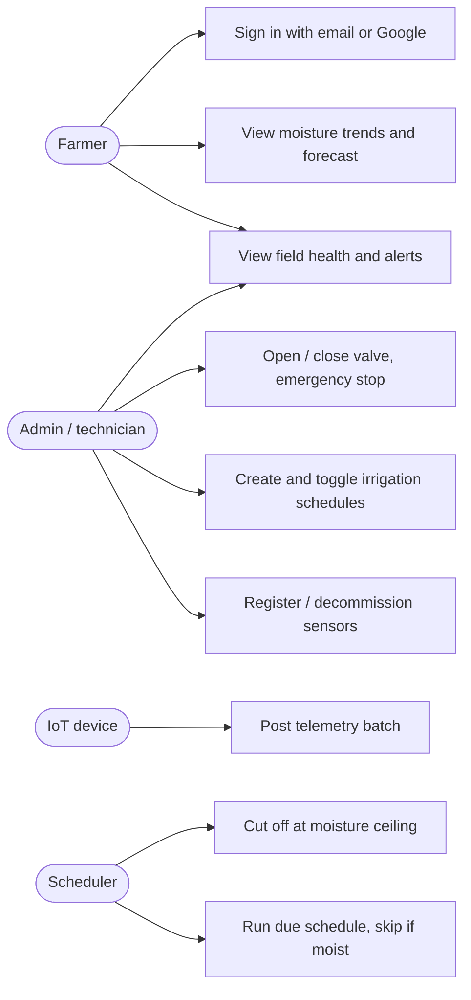

# AgriTech Sensing Solutions: Product Requirements Document

| | |
|---|---|
| Version | 1.1 (Review 1) |
| Status | Implemented and verified. Every requirement below maps to code and to a test (section 14) |
| Architecture | Spring Boot 3.3 / Spring Cloud 2023.0 microservices, Eureka discovery, Spring Cloud Gateway |

Section numbers are stable: source code cites them (`PRD 7.1`, `FR-4`, ...), so a reader can move
from any comment in the code straight to the requirement it satisfies.

---

## 1. Problem statement

Agriculture accounts for about **70 % of global freshwater withdrawals** (FAO AQUASTAT). In India,
most farms still irrigate by **calendar and habit** ("water every third morning"), using flood or
furrow methods whose field application efficiency is commonly put at **35–40 %**. That causes three
compounding losses:

1. **Water and energy waste.** Fields get watered when the soil is already moist. The pump runs
   and the water drains below the root zone.
2. **Yield loss from late action.** Stress builds between the farmer's field walks. By the time
   wilting is visible, the plant has already lost growth.
3. **No evidence trail.** Decisions aren't recorded, so nobody can say which fields are
   over-watered or what a schedule change actually saved.

**The problem in one sentence:** irrigation decisions are made without current soil data, so water
is applied when it is not needed and withheld when it is.

**Product hypothesis:** if soil moisture, temperature and pH are measured continuously, scored
against each crop's optimal band, and fed back into valve control, then a farm can:

- skip unnecessary irrigation runs,
- detect crop stress hours earlier, and
- let one operator supervise many fields from one screen.

## 2. Stakeholders and personas

| Persona | Role in system | Primary need | Pain today |
|---|---|---|---|
| **Farm operator / owner** (Ravi, 42, 6 ha, paddy + chilli) | `FARMER` (read) | "Tell me which field needs attention *now*, in plain words." | Walks every field daily; learns of stress too late |
| **Field technician / agronomist** | `ADMIN` (write) | Register sensors, set schedules, override valves safely | Manual valve operation; no remote stop |
| **IoT device** (soil probe) | Device credential, ingest only | Post readings cheaply and have bad readings rejected, not silently stored | Out-of-range readings pollute analysis |
| **Platform operator** (DevOps) | none (infrastructure) | Add capacity, find failures, keep one service's outage contained | Monoliths fail as a whole |
| **Evaluator / examiner** | none | Trace every claim to code and a test | Specs that can't be verified |

These roles have deliberately different permissions: read-only farmers and write-capable admins
(FR-2). That difference is what makes the security model more than decoration.

## 3. Design-thinking discovery (how the requirements were found)

The requirements came out of a Design Thinking and Innovation (DTI) cycle, not from a technology
wish-list.

| DTI stage | What we did | What it produced |
|---|---|---|
| **Empathize** | Studied the daily routine of small and medium farms. Mapped the "field walk → guess → water" loop. Designed a farmer survey to test these assumptions (instrument in `docs/survey/`) | The three losses in section 1 |
| **Define** | Wrote point-of-view statements. **POV-1:** *A farmer managing several fields needs to know which field is under stress without walking to it, because stress seen by eye is stress already paid for.* **POV-2:** *A technician needs to stop all water instantly and remotely, because a burst line cannot wait for someone to walk out to it.* | FR-5, FR-6, FR-8 |
| **Ideate** | "How might we" prompts: *HMW water only when the soil asks for it? HMW turn numbers into advice? HMW keep one broken sensor from breaking the farm?* | Closed-loop `skipIfMoist`, plain-language recommendations, independent services with circuit breakers |
| **Prototype** | Built six Spring Boot services behind a gateway, a device simulator (13 devices, 4 fields, 48 h backfill), and a dashboard | This repository |
| **Test** | 30 unit tests, a 31-check end-to-end smoke test, and a 17-request Postman collection. The service-outage case was tested by killing a service live | Section 9 |

## 4. Goals, success metrics and non-goals

| Goal | Metric | Target | How it is measured |
|---|---|---|---|
| Stop needless watering | Share of scheduled runs skipped because soil was already moist | Reported per run (`IrrigationScheduler`, `skipIfMoist`) | Irrigation events log `/api/irrigation/events` |
| Detect stress early | Time from threshold breach to alert | ≤ 5 min (analysis cadence, PRD 5.1) | `CropAnalysisService` schedule |
| Forecast need | Irrigation forecast horizon | 48 h | `HealthScore` / `hoursToIrrigation` |
| Supervise at scale | Fields visible to one operator | All farm fields on one dashboard | Dashboard |
| Stay available | Outage of one service must not take down the others | Other routes keep answering 200 | Verified live: crop-service killed, sensors still 200 |

**Non-goals for this release:** see section 15 (scope boundaries) and section 16 (Phase 2+).

## 5. Functional requirements

### 5.1 Data freshness
Crop health metrics are recomputed **every 5 minutes** from the latest field telemetry.
Operators can also trigger a recomputation on demand (FR-5).

### 5.2 Functional requirement list

| ID | Requirement | Acceptance criterion |
|---|---|---|
| **FR-1** | **Authentication and session lifecycle.** Email and password login issues a signed JWT access token (HS256, **15 min**), carrying subject, role, farm and a unique `jti`, plus a 30-day refresh token. Refresh **rotates** the refresh token. Logout **revokes** the access token at the gateway. | Login 200 with token; wrong password 401; reused refresh token 401; logged-out token 401 |
| **FR-2** | **Role-based authorization.** Only `ADMIN` may register, update or delete devices, create or modify schedules, or operate valves. `FARMER` is read-only. | Farmer `POST /api/sensors/register` returns 403, even with a spoofed `X-User-Role: ADMIN` header |
| **FR-3** | **Sensor device management.** Register, update, decommission and list devices with pagination and filters. Health is derived as ONLINE, OFFLINE (no reading in 15 min) or LOW_BATTERY (< 20 %). | CRUD calls. The seeded dark device shows OFFLINE |
| **FR-4** | **Telemetry ingestion and history.** Bulk ingest where each reading is validated **independently**: moisture 0–100 %, temperature −50 to 80 °C, pH 0–14, battery 0–100. One bad reading never fails the batch. History windows are selectable (e.g. `1h`, `24h`, `7d`). | 812 % moisture is rejected with `accepted=0`, while valid readings in the same batch are stored |
| **FR-5** | **Crop health scoring.** A 0–100 score per field against the crop's optimal moisture, temperature and pH band, weighted 50/30/20. Includes the health trend and environment series. | `HealthScoreTest`. Live score within 0–100 |
| **FR-6** | **Insight and alerts.** Status OPTIMAL, WARNING or CRITICAL, with plain-language recommendations and a time-to-irrigation forecast within 48 h. | `/api/crops/alerts`. Recommendations in the analyze response |
| **FR-7** | **Irrigation scheduling.** DAILY or WEEKLY schedules per valve, with create, update, activate/deactivate (PATCH) and delete. `skipIfMoist` defaults on. | `IrrigationSchedulerTest`. Smoke test creates and deletes a schedule |
| **FR-8** | **Valve control and safety.** Manual open for 1–240 minutes, and close. Opening is **refused (409)** when the field is already saturated. A running zone shuts off at the moisture ceiling. A farm-wide **emergency stop** closes every valve. | Smoke test: open 200/409, status, emergency stop |
| **FR-9** | **Service collaboration through discovery.** crop-service reads telemetry from sensor-service. irrigation-service reads crop health and notifies sensor-service. All calls address **Eureka service IDs**, never hosts or ports. | Smoke test: crop metrics contain sensor data via Eureka |
| **FR-10** | **Federated sign-in.** Google sign-in (validated through Supabase) provisions a FARMER account on first use. | `SupabaseVerifierTest` |

### 5.3 Error contract
Every error from every service and from the gateway uses one JSON envelope:
`{"error": "<code>", "message": "<human text>", "timestamp": "..."}` (see 7.3).

### 5.4 Audit
Every authentication attempt (success and failure), every logout, and every rejected token is
written to the `AUDIT` logger. Every request through the gateway is written to the `ACCESS` logger
with its correlation id, status and latency.

## 6. Non-functional requirements

| ID | Quality | Target | Measured result |
|---|---|---|---|
| **NFR-1** | Performance: end-to-end latency through the gateway (JWT validation + rate limit + routing + service) | p95 < 100 ms for reads on a developer laptop | **p50 18–28 ms, p95 38–47 ms**, n = 450 (`/api/sensors/summary`, `/api/crops`, `/api/valves`) |
| **NFR-2** | Capacity protection | 100 req/min public (per IP), 1000 authenticated (per user), 100 per device | `RateLimitFilter`, `X-RateLimit-*` headers |
| **NFR-3** | Availability and fault isolation | A failed service yields a fast 503 with `Retry-After`. Other routes are unaffected | Circuit breaker per route (7.5). Verified by killing crop-service |
| **NFR-4** | Scalability | Any service scales horizontally by starting another instance. No config change needed | `lb://` + Eureka round-robin (8.2) |
| **NFR-5** | Security | No endpoint reachable without a valid token except the listed public paths. Services reject calls that did not come through the gateway | Sections 7.4 and 10. 14 security unit tests |
| **NFR-6** | Accessibility | WCAG 2.1 AA contrast (≥ 4.5:1) in both themes | README design-system notes |
| **NFR-7** | Maintainability | One responsibility per service, shared code only in `common`, every requirement traceable | Section 14 |
| **NFR-8** | Payload safety | Request bodies capped at 1 MB | Smoke test: 1.1 MB body returns 413 |

## 7. API gateway specification

### 7.1 Routing: single entry point
| Path | Service |
|---|---|
| `/api/auth/**` | auth-service |
| `/api/sensors/**`, `/api/telemetry/**` | sensor-service |
| `/api/crops/**` | crop-service |
| `/api/irrigation/**`, `/api/valves/**` | irrigation-service |

Routes target `lb://<service-id>`. No host or port appears anywhere in the gateway config.

### 7.2 Rate limiting
Three tiers (NFR-2). Every response carries `X-RateLimit-Limit` and `X-RateLimit-Remaining`. The
429 response uses the 7.3 envelope.

### 7.3 Error envelope
See 5.3. Gateway rejections (401, 403, 404, 413, 429, 503) use the same shape as the services.

### 7.4 Edge security (ordered global filters)
1. **RequestIdFilter** (order −200). Assigns or propagates `X-Request-Id`, marks responses
   `Cache-Control: no-store`, and writes the access log.
2. **JwtAuthFilter** (order −100). Verifies signature, expiry and revocation. Public paths are
   **exact matches** only. **Always strips** client-supplied identity headers, then sets verified
   ones and **HMAC-signs** them (`X-Gateway-Signature`, `X-Gateway-Timestamp`).
3. **RateLimitFilter** (order −50).
4. Default route filters: **SecureHeaders** (CSP, HSTS, X-Frame-Options DENY, nosniff,
   Referrer-Policy, …) and **RequestSize** (1 MB).

### 7.5 Resilience
Each route has a **Resilience4j circuit breaker**:

- It **opens** when 50 % of the last 10 calls fail (minimum 5 calls).
- It stays open for 10 s, then **probes** with 2 half-open calls.

Its fallback (`/fallback/<service>`) returns 503 with `Retry-After: 10`. Connection timeout is 2 s
and response timeout is 10 s. Breaker state is visible at `/actuator/circuitbreakers` (admin
token).

## 8. Service discovery

### 8.1 Health checks
Instances renew their lease with Eureka every **30 s** and are evicted after **90 s** without renewal.

### 8.2 Load balancing
Gateway routes and inter-service `RestTemplate`s are `@LoadBalanced`. Calls are round-robined
across healthy instances of a service ID, so adding capacity means starting another process.

## 9. Verification plan

| Level | Artifact | Count |
|---|---|---|
| 9.1 Unit | `HealthScoreTest`, `IrrigationSchedulerTest`, `SupabaseVerifierTest`, `JwtAuthFilterTest`, `InternalAuthTest` | 30 tests |
| 9.2 API | `AgriTech_Fast_Test.postman_collection.json` (auto-saves the token, asserts 2xx on every request) | 17 requests |
| 9.3 End-to-end | `scripts/smoke-test.sh`. **Scenario 1:** ingestion → health → irrigation. **Scenario 2:** authentication, routing, authorization. **Scenario 3:** discovery, token lifecycle, gateway hardening | 31 checks |
| 9.4 Fault injection | Kill a service mid-run, then check for a fast 503 fallback while the other routes stay 200 | Manual, documented |

## 10. Security model and threat analysis

| Threat | Control | Evidence |
|---|---|---|
| Password disclosure | BCrypt hashes | `AuthController` |
| Forged or tampered token | HS256 signature verified at the gateway. `alg:none` is refused | `JwtAuthFilterTest` (forged key, alg none) |
| Expired or stolen token | 15-minute access TTL. Refresh rotation. `jti` revocation on logout | Smoke test (refresh replay → 401, logout → 401) |
| Role escalation via headers | Gateway strips `X-User-*` on **every** request, including public ones | `JwtAuthFilterTest.clientSuppliedIdentityHeadersAreReplaced` |
| Bypassing the gateway (calling :8082 directly) | Services accept `/api/**` only with a valid HMAC gateway signature ≤ 60 s old. Peer services sign their own calls as `SERVICE` | `InternalAuthTest` (5 cases). Smoke test: direct call → 401 |
| Prefix-matching public paths | Exact-match whitelist | `JwtAuthFilterTest.publicPathsAreExactMatches` |
| Flooding and oversized payloads | Three-tier rate limit. 1 MB body cap | Smoke test (413) |
| Clickjacking, MIME sniffing, downgrade | SecureHeaders: X-Frame-Options, nosniff, HSTS, CSP | Smoke test |
| Sensitive data cached by browsers or proxies | `Cache-Control: no-store` | Smoke test |
| Secrets in source | Dev defaults only. Override with `AGRITECH_JWT_SECRET` and `AGRITECH_INTERNAL_SECRET` env vars. `.env` files are git-ignored | `application.yml` |

## 11. Observability

### 11.1 Metrics
The following are exposed:

- `/actuator/health` on every service,
- `/actuator/circuitbreakers` and `/actuator/gateway` on the gateway,
- `/api/telemetry/stats` for ingestion volume.

The `X-Request-Id` correlation id appears in the gateway `ACCESS` log and is forwarded to every
service.

## 12. Constraints and assumptions

- Runs on one developer machine, Java 21, with no Docker required. `scripts/stack.ps1` starts all
  six processes in dependency order.
- Each service owns its own data store (H2 in-memory per service). No service reads another's
  database.
- Devices can reach the gateway over HTTP(S) and post JSON. The bundled simulator stands in for
  field hardware.
- Soil optimal bands per crop are agronomic defaults and are configurable per crop.

## 13. Actors and use cases

## 14. Traceability matrix

| Req | Implemented in | Verified by |
|---|---|---|
| FR-1 | `auth-service/JwtService`, `AuthController` (`/login`, `/refresh`, `/logout`), `api-gateway/JwtAuthFilter`, `RevocationCache` | `JwtAuthFilterTest` (8), smoke test (login, refresh, rotation, logout) |
| FR-2 | `common/CallerContext.requireAdmin`, `common/InternalAuth` | Smoke test (farmer 403, escalation 403), `InternalAuthTest` |
| FR-3 | `sensor-service/SensorController`, `SensorDevice.health()` | Smoke test (register, delete), Postman |
| FR-4 | `sensor-service/TelemetryController.ingest/validate/history` | Smoke test (valid accepted, 812 % rejected), Postman |
| FR-5 | `crop-service/HealthScore`, `CropAnalysisService`, `CropController` | `HealthScoreTest`, smoke test (score 0–100) |
| FR-6 | `HealthScore` forecast, `CropController.alerts` | `HealthScoreTest`, Postman |
| FR-7 | `irrigation-service/IrrigationController`, `IrrigationScheduler` | `IrrigationSchedulerTest`, smoke test (create, delete) |
| FR-8 | `ValveController`, `ValveService` | Smoke test (open, status, emergency stop), Postman |
| FR-9 | `crop-service/SensorClient`, `irrigation-service/FarmClient`, `@LoadBalanced` | Smoke test (metrics via Eureka) |
| FR-10 | `SupabaseVerifier`, `AuthController.google` | `SupabaseVerifierTest` |
| NFR-1 | Gateway pipeline | Latency run (section 6) |
| NFR-2 | `RateLimitFilter` | Smoke test (headers) |
| NFR-3 | Gateway `CircuitBreaker` + `FallbackController` | Fault-injection run, smoke test (4 breakers) |
| NFR-4 | Eureka + `lb://` | Smoke test (5 services registered) |
| NFR-5 | Sections 7.4 and 10 | 14 security unit tests + 8 smoke checks |
| NFR-8 | `RequestSize` default filter | Smoke test (413) |

## 15. Scope boundaries and architectural debt

Each of these is a deliberate cut, marked in code with a `ponytail:` comment. Each has a known
ceiling and a named upgrade path.

| Simplification | Ceiling | Upgrade |
|---|---|---|
| H2 in-memory per service | Data lost on restart | PostgreSQL, one schema per service, plus Flyway. TimescaleDB for telemetry |
| In-memory rate-limit counters | N gateway replicas allow N× the quota | Redis `RequestRateLimiter` |
| Revocation list polled every 15 s | Logged-out token usable ≤ 15 s | Shared Redis revocation set |
| Refresh tokens in memory | Restart logs everyone out | Redis or DB-backed `TokenStore` |
| Symmetric HS256 signing | Gateway holds the minting key | RS256/ES256: gateway keeps only the public key |
| Health analysis every 5 min (poll) | Up to 5 min alert latency | Kafka topic between ingestion and analysis |
| Device simulator | Not a real protocol adapter | MQTT bridge. Devices already use the same ingest contract |

## 16. Phase 2+ roadmap
- Docker Compose / Kubernetes manifests, with services on a private network behind the gateway.
- Distributed tracing (Micrometer Tracing + Zipkin) using the existing `X-Request-Id`.
- Weather-forecast input (skip irrigation before predicted rain).
- Multi-farm tenancy: `farmId` scoping on every query, and farm-admin role.
- SMS / WhatsApp alerts in the farmer's language.
