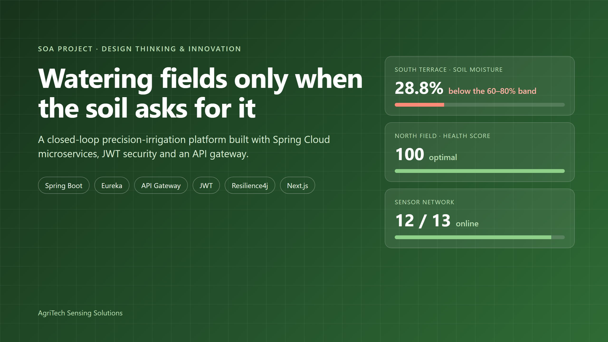

# Watering fields only when the soil asks for it: building a precision-irrigation platform with microservices

Agriculture uses about **70% of the world's freshwater** (FAO). Much of it is applied in the least precise way possible: water on a fixed calendar, whether or not the soil needs it. For our Service-Oriented Architecture project we set out to change one small thing: **let the soil decide when the field gets water.**

This is the story of how we used **Design Thinking & Innovation (DTI)** to find the real problem, and how we built **AgriTech Sensing Solutions**: six Spring Boot microservices behind a secured API gateway, closing the loop from soil sensor to valve.

## 1. Empathize: who is losing what?

We started with the farmer, not the tech stack. We mapped a typical day on a small or medium farm and found a loop that repeats every day: **walk the field → guess → water on schedule.** Three losses come out of that loop:

- **Wasted water and power.** Fields get irrigated when the soil is already moist, and the pump runs for nothing.
- **Late action.** When wilting is visible, the plant has already lost growth. Stress you can see by eye is stress you have already paid for.
- **No evidence.** Decisions aren't recorded, so nobody can say which field is over-watered or what a change actually saved.

## 2. Turning assumptions into survey questions

Empathy maps are full of assumptions, so we wrote each one down as something a farmer could prove wrong. The result is a 16-question survey in three parts: current practice, the proposed solution, and feedback on the prototype. Each assumption we test maps to one feature:

- **"Irrigation is decided by calendar, not by soil."** We ask how the farmer decides when to water, and whether they watered an already-wet field last season. This drove the closed-loop *skip-if-moist* rule.
- **"Stress is noticed too late."** We ask whether wilting appeared before the farmer noticed dry soil. This drove the live health score, alerts and the 48-hour forecast.
- **"Numbers alone don't help."** We ask whether "water in the next 6 hours" beats "moisture 28%". This drove recommendations written as plain sentences.
- **"Control matters as much as data."** We ask how important a remote emergency stop is, and who else should see or control the fields. This drove the emergency stop and separate farmer and admin roles.

Writing the survey before the code kept us honest: every feature has a question that could prove it unnecessary. **If you farm, or work with farmers, I'd love your answers in the comments.** Real field experience is exactly what the next iteration needs.

## 3. Define and ideate

We turned the insights into point-of-view statements:

> A farmer managing several fields needs to know which field is under stress without walking to it, because stress seen by eye is stress already paid for.

> A technician needs to stop all water instantly and remotely, because a burst line can't wait for someone to walk out to it.

Then we asked "How might we…" questions. How might we water only when the soil asks? Turn numbers into advice? Stop one broken component from breaking the whole farm? The last question is what pushed us toward **microservices**.

*The DTI cycle. Each stage produced a concrete requirement in the code.*

## 4. The system architecture

We split the platform by business capability, so each service owns its own data and can fail, scale and deploy independently:

- **API Gateway:** the single entry point. It handles JWT validation, signed identity, rate limiting, circuit breakers and security headers.
- **auth-service:** login, 15-minute JWTs, rotating refresh tokens, logout revocation and Google sign-in.
- **sensor-service:** the device registry, plus telemetry ingestion with per-reading validation and history.
- **crop-service:** a 0–100 health score, alerts, plain-language advice and a 48-hour forecast.
- **irrigation-service:** schedules, valve control, moisture cut-off and the emergency stop.
- **Eureka:** the service registry, with a 30 s heartbeat, 90 s eviction and client-side load balancing.

*One door in. Services find each other through Eureka, never by a hard-coded host or port.*

**Service discovery** is what makes this real microservices rather than a distributed monolith. No service knows another's address. crop-service asks Eureka for sensor-service, gets a healthy instance, and round-robins across however many are running. To add capacity, you start another process.

*All five services registered and UP in the Eureka registry.*

## 5. Security: JWT authentication and a zero-trust gateway

Authentication happens **once, at the edge.** The gateway verifies each JWT's signature, expiry and revocation status before it routes anything. We went beyond a basic setup in four ways:

- **Short-lived tokens.** Access tokens live 15 minutes. The dashboard renews them silently with a refresh token that **rotates** on every use, so a replayed refresh token is refused.
- **Real logout.** Every token carries a unique ID. Logging out revokes it at the gateway, even though the token hasn't expired yet.
- **No header spoofing.** The gateway strips any identity headers a client sends and replaces them with the verified identity.
- **Zero trust behind the gateway.** The gateway **HMAC-signs** the identity it forwards, and every service rejects a request whose signature is missing, altered or older than 60 seconds. Calling a service's port directly while claiming to be an admin gets you a 401.

*How a request earns trust, and the attacks we tested against.*

The gateway also adds **OWASP security headers** (CSP, HSTS, X-Frame-Options, nosniff) and three-tier rate limiting (100 public, 1,000 authenticated and 100 device requests per minute). It caps request bodies at 1 MB, gives every request a **correlation ID**, and puts a **Resilience4j circuit breaker** on every route. If a service dies, callers get a fast, well-formed 503 with a retry hint instead of a hung connection, and the other services carry on.

## 6. The prototype

A role-aware dashboard shows the whole farm on one screen. Farmers see the data and administrators control the hardware; the interface adapts to the role inside the token.

*Operations dashboard: field health, sensor network status and a live alert feed.*

*Crop monitoring: each field scored against its own optimal band, with trend lines.*

*Irrigation control: schedules that skip a run when the soil is already wet enough.*

## 7. Testing: proving it works

We treated testing as the **Test** stage of DTI, not an afterthought:

- **30 unit tests**, including 8 attack cases on the gateway's JWT filter (forged key, unsigned token, expired, revoked, spoofed headers) and 6 on the internal signature check.
- **31 end-to-end checks** against the running stack, covering the path from ingestion to health score to irrigation, plus authorization and gateway hardening.
- **17 Postman requests** that run automatically with newman.
- **Fault injection.** We killed crop-service mid-run. The gateway answered with a 503 fallback in milliseconds, and sensors and valves kept answering 200.
- **Performance.** p95 read latency through the whole gateway pipeline was about 40 ms.

*Results from the running stack. Every check can be re-run from the repository.*

## 8. Innovations

1. **Closed-loop irrigation.** Before a scheduled run, irrigation-service asks crop-service whether the field needs water, and **skips the run** if the soil is already moist. A running valve also shuts itself off when moisture reaches the crop's ceiling.
2. **Health scoring with advice.** Moisture, temperature and pH are scored against each crop's own optimal band (weighted 50/30/20) and turned into sentences a farmer can act on.
3. **48-hour irrigation forecast.** The recent moisture trend is extrapolated to predict when a field will need water, so the farmer can plan instead of react.
4. **Zero trust without a service mesh.** HMAC-signed identity between the gateway and the services closes the gap that "services just trust the headers" usually leaves open.
5. **Fault isolation by design.** Per-route circuit breakers and per-reading validation mean one broken sensor or service never takes the farm down.
6. **Safety first.** A farm-wide emergency stop, and valves that refuse to open on an already-saturated field.

## 9. What we learned

- **Design thinking changed the architecture.** "How might we stop one failure from breaking the farm?" is a microservices question, and it came from empathy, not from a tech checklist.
- **Security is a chain.** A perfect JWT check at the gateway means nothing if a service trusts any request that reaches its port. Signing the forwarded identity fixed that.
- **Test the unhappy path.** Our most convincing demo isn't the dashboard. It's killing a service live and watching everything else stay up.

## What's next

Weather-aware scheduling (skip before predicted rain), SMS alerts in Telugu, a PostgreSQL database per service, containerised deployment, and Kafka event streaming between ingestion and analysis.

Thanks to our faculty for their guidance throughout this project, and to my teammates for the long debugging sessions.

**Source code:** https://github.com/Anjanikumarkarlapati/SOA_project

I'd love feedback, especially from anyone who has worked on IoT, agriculture or microservice security. What would you build next?

#Microservices #SpringBoot #SpringCloud #APIGateway #JWT #DesignThinking #AgriTech #PrecisionAgriculture #IoT #SoftwareArchitecture #DTI #SOA

